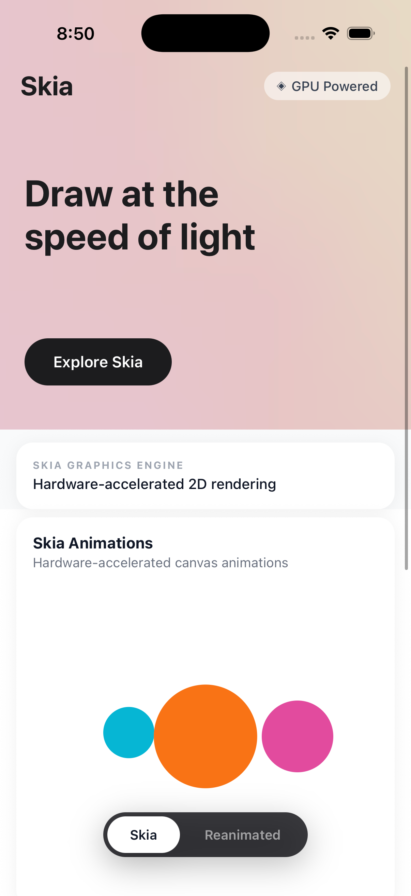
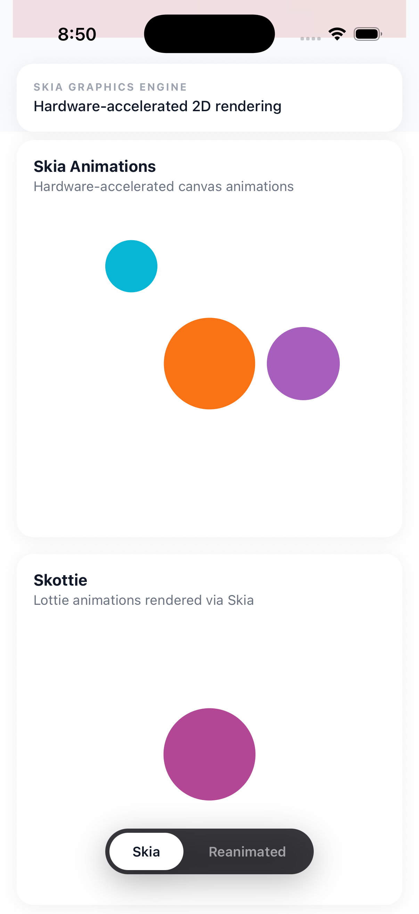
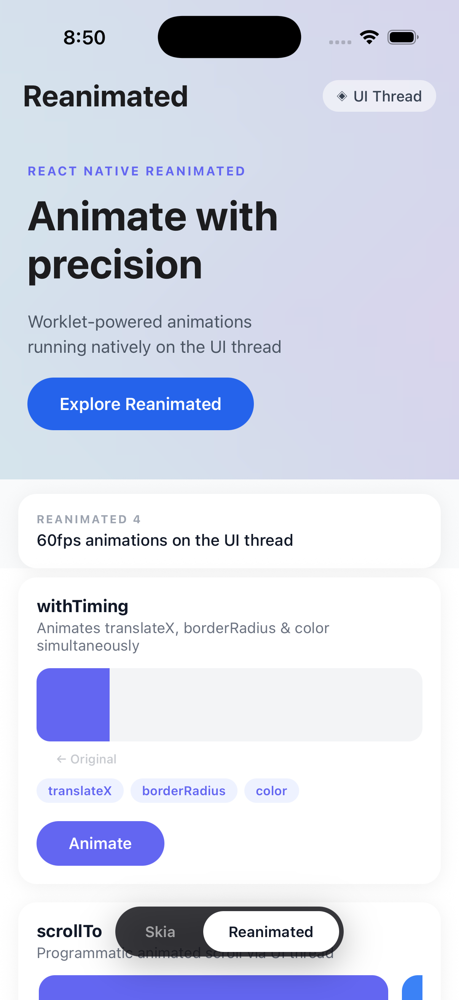
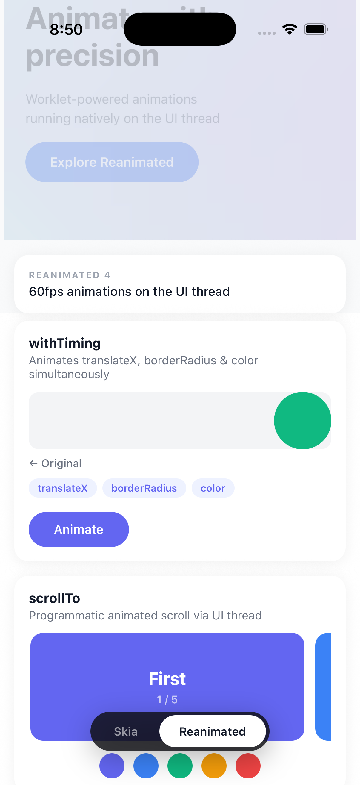
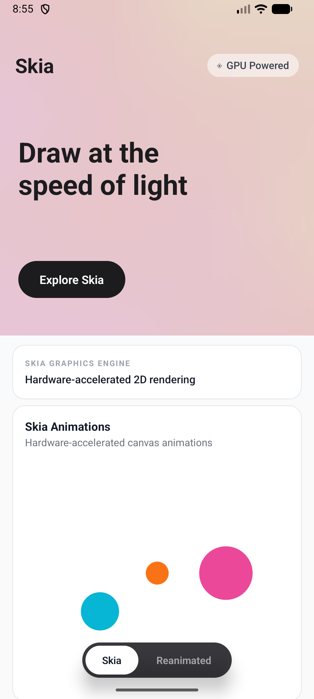
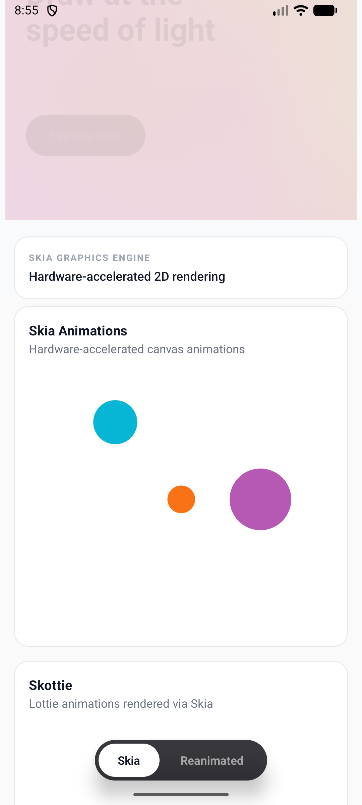
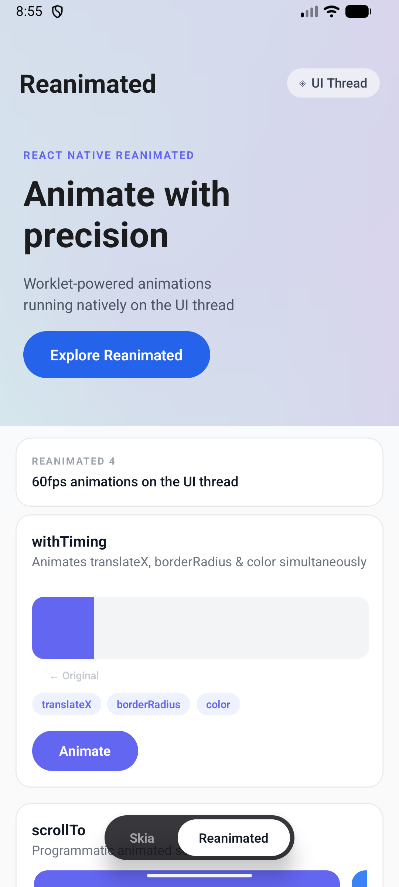
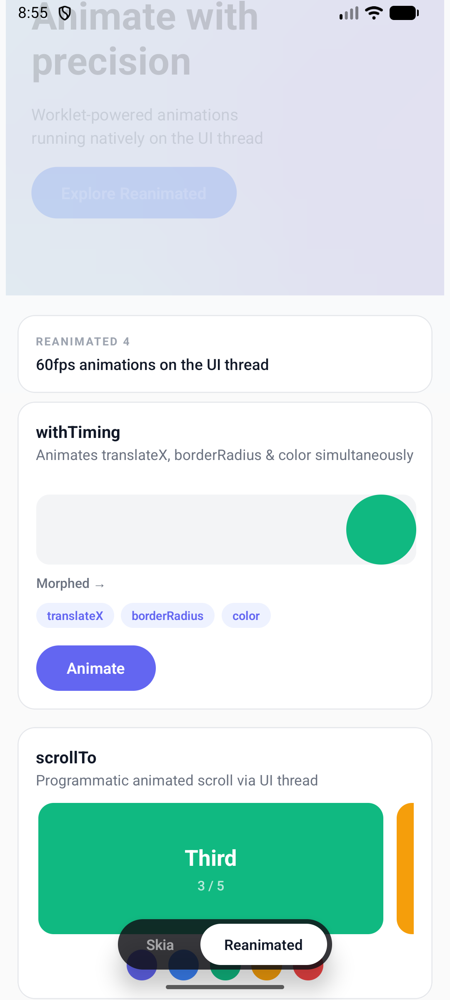

# React Native Skia Playground

A playground to test [Skia](https://shopify.github.io/react-native-skia/) and animations using [React Native Reanimated](https://docs.swmansion.com/react-native-reanimated/).

---

## Preview

<video src="sample/Demo.mp4" controls width="320"></video>

---

## Screenshots

<details open>
<summary>iOS</summary>

<br>

<table>
  <tr>
    <td></td>
    <td></td>
  </tr>
  <tr>
    <td></td>
    <td></td>
  </tr>
</table>

</details>

<details>
<summary>Android</summary>

<br>

<table>
  <tr>
    <td></td>
    <td></td>
  </tr>
  <tr>
    <td></td>
    <td></td>
  </tr>
</table>

</details>

---

## Getting Started

> **Note**: Make sure you have completed the [Set Up Your Environment](https://reactnative.dev/docs/set-up-your-environment) guide before proceeding.

### Step 1: Start Metro

```sh
# Using npm
npm start

# OR using Yarn
yarn start
```

### Step 2: Build and run your app

#### Android

```sh
npm run android
# OR
yarn android
```

#### iOS

Install CocoaPods dependencies (first clone or after updating native deps):

```sh
bundle install
bundle exec pod install
```

Then run:

```sh
npm run ios
# OR
yarn ios
```

### Step 3: Modify your app

Open `App.tsx` and make changes. The app will auto-update via [Fast Refresh](https://reactnative.dev/docs/fast-refresh).

---

## Troubleshooting

See the [Troubleshooting](https://reactnative.dev/docs/troubleshooting) page.

## Learn More

- [React Native docs](https://reactnative.dev/docs/getting-started)
- [React Native Skia](https://shopify.github.io/react-native-skia/)
- [React Native Reanimated](https://docs.swmansion.com/react-native-reanimated/)
